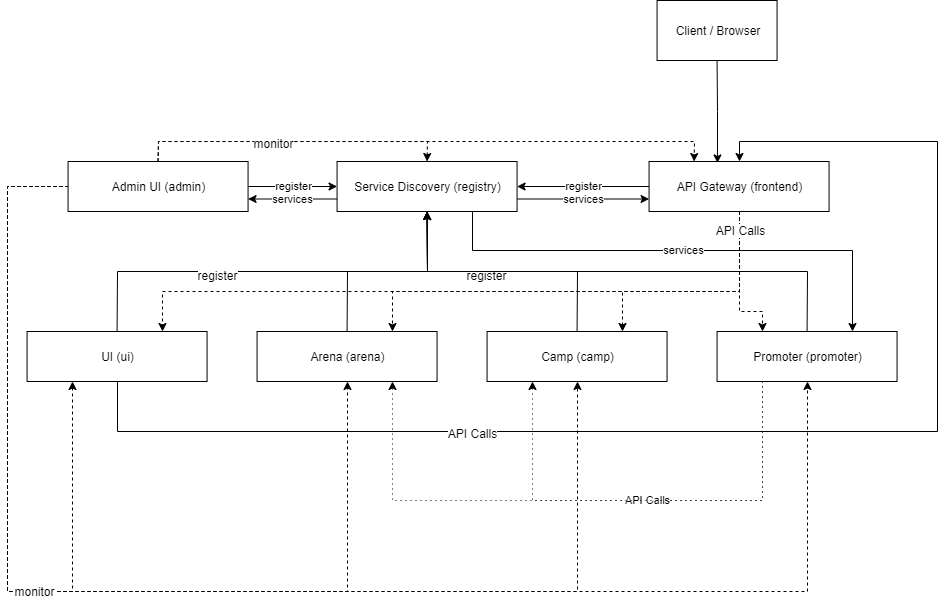
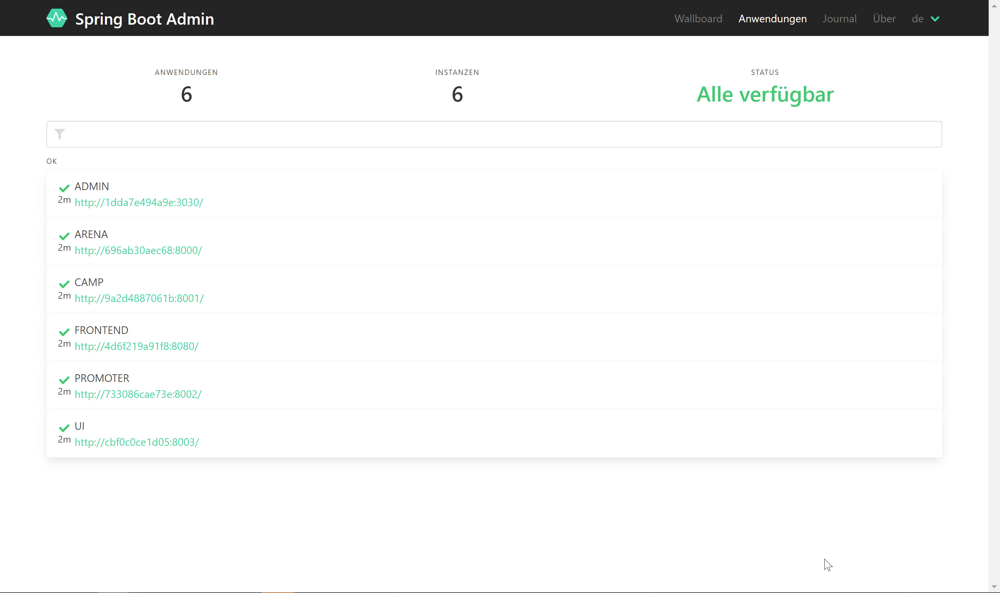
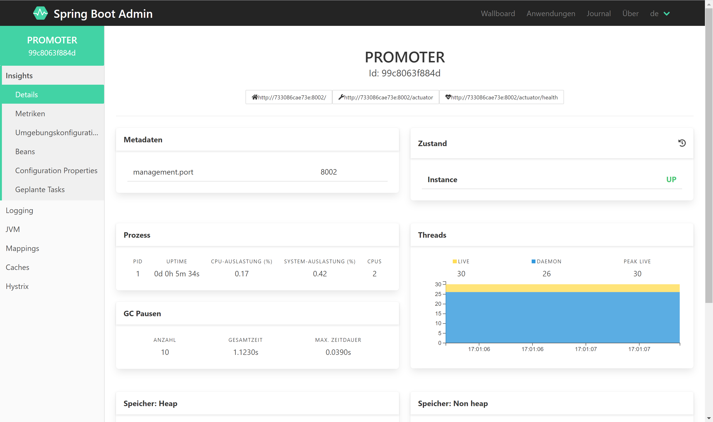
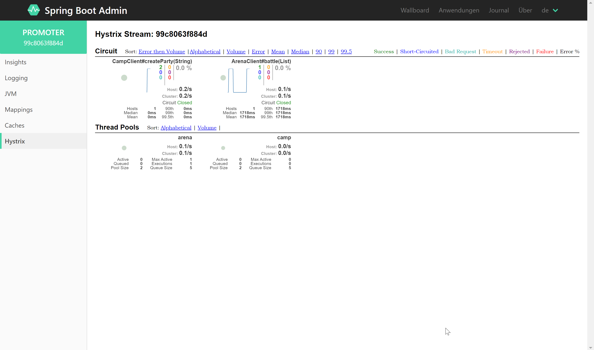
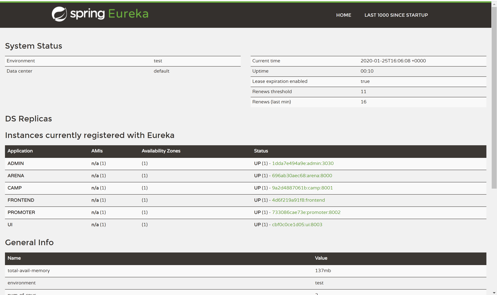
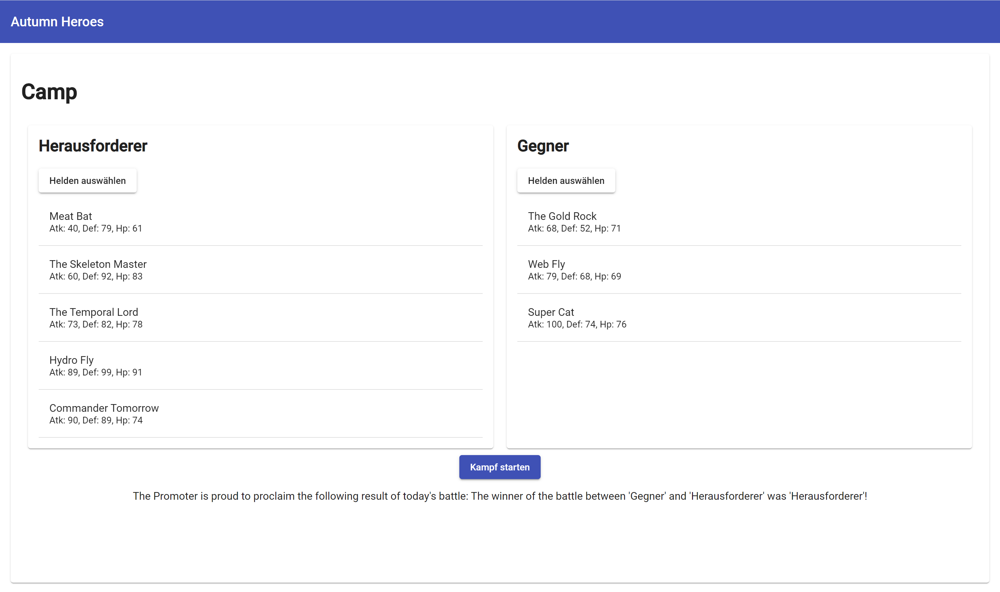

# heroes

## Changes made to the original project
- Use Lombok `@Data` instead of `getters` and `setters`
- (depcrecated) Use `spring-boot-starter-data-jpa` instead of single packages
- (depcrecated)  Use `@SpringApplication` instead of manually creating Spring Context
- (depcrecated)  In parent module, added `spring-boot-starter-parent`
- (depcrecated)  Versions in Submodule are gotten from parent module `spring-boot-starter-parent`
- Use `spring-boot-devtools` and `spring-boot-starter-web` for h2 Console, see https://stackoverflow.com/questions/43952259/springboot-accessing-h2-console
- (depcrecated) Not using any `JavaConfig`
- Use Constructor Injection with `@RequiredArgsConstructor`
   - See https://www.baeldung.com/spring-injection-lombok
- do not use parent pom.xml from heroes, to remove dependency
## (depcrecated) Connecting to the h2 console
1. Goto `localhost:8080/h2-console`
2. Use default settings, but change `JDBC URL` to `jdbc:h2:mem:testdb`

See also: 
- https://www.baeldung.com/spring-boot-h2-database

## Access HATEOAS REST APIs
REST APIs are automatically created by `@RepositoryRestResource` with the `spring-boot-starter-data-rest` dependency which under the hood uses HATEOAS.
The APIs are published under `localhost:8080/spring-rest-hateoas/<entity>` where `<entity>` corresponds to either `heroes` or `parties`.

See also:
- https://www.baeldung.com/spring-rest-hal
- https://www.baeldung.com/spring-data-rest-intro
- https://spring.io/guides/gs/accessing-data-rest/
- https://spring.io/guides/tutorials/rest/

### Access HAL Browser
When accessing `localhost:8080/spring-rest-hateoas/` you'll automatically get redirected to the HAL Explorer. 

## Access Spring Boot MVC manual REST APIs
Go to `localhost:8080/api/<entity>`

## Running with mocked MongoDB
Comment out the line `<scope>test</scope>` of the dependency `de.flapdoodle.embed.mongo`.

See also: 
- https://www.baeldung.com/spring-boot-embedded-mongodb

## Creating mock data
Edit the file `resources/data/heroes.json` to add new heroes at startup.

See also: 
- https://www.baeldung.com/spring-data-jpa-repository-populators 

# Änderung der Aufgabenstellung
In gewissen Bereichen haben wir die Aufgabenstellung leicht angepasst. Dies, dass wir noch zusätzliche Sachen lernen und um die Architektur besser aufziehen können.
Folgende Sachen wurden angepasst:

**Änderungen**
- Entfernen des `heroes` (parent) POM: Wir haben das parent POM entfernt, dass die Microservice ohne Abhänigkeit zum parent POM gebaut werden können. Microservices sollten nach uns auch ohne das Parent POM lauffähig sein und daher haben wir uns für diesen Schritt entschieden. Die einzigen Vorteile, welche wir mit dem Parent POM gesehen haben, ist die zentrale Versionsverwaltung der Spring Boot Version, die globalen Abhängigkeiten sowie das bauen aller Module gleichzeitig. Jedoch sollte es unserer Meinung nach in einer Microservice Architektur erlaubt sein, verschiedene Versionen von bspw. Spring Cloud zu verwenden. Unteranderem aufgrund dessen, haben wir das Parent POM gelöscht.  
- Verwenden des neuen Spring Cloud Stacks: Wo möglich haben wir die neuen Komponenten des Spring Cloud Stacks verwendet und auf solche, welche im Maintenance-Mode sindnd zu verzichten.
    - Verwendung von `Spring Cloud Gateway` anstatt von `Netflix Zuul API Gateway`
    - Verwendung von `Spring Cloud LoadBalancer` anstatt von `Netflix Ribbon`
    - Leider konnten wir `Netflix Hystrix` und das `Netflix Hystrix Dashboard` nicht so leicht ersetzen, da `Feign` standardmässig `Hystrix` verwendet. Beim `Ribbon` konnten wir dies konfigurativ ausschalten, bei `Hystrix` leider nicht. Dazu kommt, dass es in der neuen Spring Cloud Welt keinen Ersatz für das `Hystrix Dashboard` gibt, so dass man selbst mit `Micrometer` und `Prometheus` sowie `Grafana` ein Monitoring aufbauen muss. Dies würde jedoch den Rahmen dieses Projektes sprengen. 
   
**Zusätzliches**
- Verwendung von `Spring Actuator` für das bereitstellen von Applikationsinfos (Status, etc.)
- Implementierung von `Spring Boot Admin` als zentrales Management-Dashboard
    - Einbindung des `Hystrix Dashboards` von `promoter` in `Spring Boot Admin`
    - Anzeigen von Logdateien, JMX Infos, etc. im Spring Boot Admin
- Verwendung von `lombok` und dessen Annotationen wie zum Beispiel
    - `@Data` anstatt von `getters` und `setters`, ...
- Verwendung von Constructor Injection im Zusammenhang mit Lombok (Annotation `@RequiredArgsConstructor`)
- Verwendung unterschiedlicher Profile für die Entwicklung und die Docker Umgebung

# Architektur
## Übersicht

## Module
Folgende Module sind vorhanden:

| Modul      | Beschreibung |
|------------|--------------|
| `admin`    | Admin UI mit `Spring Boot Admin` inkl. `Hystrix Dashboard` für `promoter` Microservice |
| `arena`    | Microservice, bei welchem sich zwei Parties bekämpfen können und der Gewinner ermittelt wird. |
| `camp`     | Hier befinden sich die Heroes und es können entsprechend neue Parties erstellt werden. |
| `frontend` | `Spring Cloud Gateway` API Gateway. Alle Microservices werden automatisch über diesen API Gateway publiziert. Dieser dient als zentraler Einstiegspunkt.             |
| `promoter` | Über den `promoter` Microservice kann entweder ein zufälliger Kampf erstellt werden oder auch einen mit zwei zuvor erstellten Parties. Der Gewinner wird über den entsprechenden `arena` Microservice ermittelt.              |
| `registry` | `Spring Cloud Eureka Server` dient als zentrale Service Discovery. Alle Applikatonen melden sich hier an und können von anderen Applikationen ermittelt werden. |
| `ui`       | Angular Frontend Applikation, bei welcher neue Parties erstellt werden können und anschliessend zu einem Kampf geschickt werden können und der Gewinner ermittelt wird. |

# Zugänge
| Zugang                                  | Über API Gateway         | Direkt \(über Docker nicht alles offen\) |
|-----------------------------------------|--------------------------|------------------------------------------|
| Service Discovery \`registry` Dashboard | \-                       | localhost:8761                           |
| Admin UI \`admin`                       | \-                       | localhost:3030                           |
| Angular Frontend \`ui` Modul            | localhost:8080/ui/       | \-                                       |
| \`arena` Microservice                   | localhost:8080/arena/    | localhost:8000                           |
| \`camp` Microservice                    | localhost:8080/camp/     | localhost:8001                           |
| \`frontend` Microservice                | localhost:8080/          | localhost:8080                           |
| \`promoter` Microservice                | localhost:8080/promoter/ | localhost:8002                           |

## Admin UI
### Übersicht

### Microservice Übersicht

### Hystrix Integration

## Service Discovery Dashboard

## UI

# Getting started
## Notwendige Tools
- Java
- Maven
- Docker
- Docker Compose
- npm (für Angular Frontend)
## Starten der Applikation
### Mit Docker
Falls die Images noch nicht gebuilded wurden, müssen diese zuersten mit `docker-compose build` erstellt werden.

Danach können die Microservices mit `docker compose up` gestartet werden. 
Nach einiger Zeit sind alle Microservices gestartet und an der Service Discovery angemeldet. Anschliessend sind diese über den API Gateway verfügbar.
### Ausführen der Backend Services
Da sich die entsprechenden Microservices an der Service Registry anmelden, wird empfohlen zuerst das Modul `registry` zu starten. 

Die Microservices können auch einzelnen ausgeführt werden. Dazu navigiert man in das entsprechende Verzeichnis und führt `mvn spring-boot:run` aus. Bei dem `ui` Modul muss zusätzlich zuerst das Angular Frontend gebaut werden. Weitere Informationen sind unter dem entsprechenden Abschnitt vorhanden.
Falls der `frontend` API Gateway gestartet wurde, sind die Microservices auch über `localhost:8080/{name}/` aufrufbar. 

Für die `camp` Applikation muss lokal eine MongoDB gestartet werden. Dies kann erreicht werden, in dem schon lokal eine MongoDB Datenbank installiert und gestartet wurde oder mit `docker-compose run mongodb`. 
## Mockdaten
Mockdaten für die Heroes können unter `src/main/resources/data/heroes.json` bearbeitet werden.
## Bauen der Applikation
### Mit Docker
Die Docker Images können mit dem Befehl `docker-compose build` ausgeführt werden. Dazu werden Docker Multi-Stage Builds verwendet, um die Java sowie Angular Applikationen zu bauen.
### Mit maven und npm
Alle Applikationen bis auf das `ui` Modul können wie folgt gebaut werden:
``mvn clean install``

Beim `ui` Modul müssen zuerst die npm Abhängigkeiten mit `npm install` installiert werden. Anschliessend müssen die Dateien in den Ordner  `/app/src/main/resources/static` kopiert werden. Schlussendlich kann der Java Microservice per `mvn clean install` gebaut werden. 

Die oben erwähnten Schritte sind mit den Docker Builds automatisiert, daher empfehlt es sich entsprechend Docker zu verwenden.

## Java Profile
| Profil                               | Beschreibung                                                                                    |
|--------------------------------------|-------------------------------------------------------------------------------------------------|
| default \(application\.yml\)         | Standard Profil für die lokale Entwicklung\.                                                    |
| Produktion \(application\-prd\.yml\) | Dient zum Ausführen in Docker\. Erbt vom Standard Profil, setzt aber eine andere Registry URL\. |

## Docker
Um die entsprechenden Applikationen zu bauen sowie zu betreiben, haben wir uns für Docker entschieden. Dass, da so nicht zwingend alle Tools (Maven, npm, ...) installiert sein müssen.
In jedem Microservice befindet sich entsprechend ein `Dockerfile`.

In jedem `Dockerfile` wird beschrieben, wie die Applikation gebaut werden muss, als auch wie sie gestartet werden kann. 

Um das Bauen und Starten der Microservice Architektur zu vereinfachen, haben wir zudem Docker Compose eingesetzt. Alle Microservices können so zusammen gebaut werden und entsprechend ihren Abhängigkeiten gestartet werden.

Zusätzlich zu allen Microservices welche gestartet werden, wird für die Arena noch eine MongoDB gestartet, in welcher sie die Heroes speichert.

### Multi-Stage Builds
Folgende Stages existierteren beim Docker Build:

**dependencies**

Die Maven Abhängigkeiten werden installiert und gecached. Wird mithilfe eines Maven Images gemacht.

**build-angular**

Nur beim `ui` Modul. Die statischen Ressourcen (HTML, css, js) von Angular Frontend wird generiert. Als Basis dazu dient ein node Image.

**build/build-java**

Der `.jar` Datei des Microservice / Spring Boot Applikation wird gebaut. Wird mithilfe eines Maven Images gemacht. Beim `ui` Modul werden zusätzlich noch die generierten Angular Ressourcen in den `static` Ordner kopiert.

**default**

Die `.jar` Datei des Microservice / Spring Boot Applikation wird gestartet. Das Base Image von Docker dafür ist ein OpenJDK 11.
